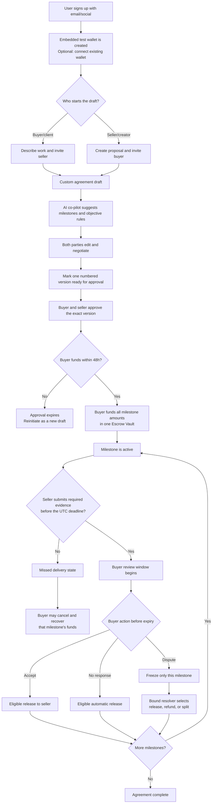

# Custom payment agreement lifecycle

This is the product flow for the **testnet prototype**. It explains the user experience and business rules; it does not make a production custody, fiat-conversion, or legal-compliance claim.

## The one-sentence flow

Either party proposes custom payment rules; both approve the exact same version; the buyer funds one per-agreement Escrow Vault; each milestone releases, refunds, or is resolved only under those pre-agreed rules.

## 1. Registration and wallet setup

1. A client or creator signs up with email or social login.
2. The product creates an embedded, self-custodial **test wallet** for first-time Web3 users. A user may instead connect an existing wallet.
3. In the prototype, the wallet receives clearly valueless mock USDT for demonstrations. There is no real-money top-up, exchange, or cash-out claim.

## 2. Custom agreement creation

1. Either person can be the **proposer**:
   - A buyer starts from a brief: “I need a creator to deliver X.”
   - A seller starts from a quote: “Here is my proposal for X.”
2. The proposer invites the other party by email or share link.
3. The agreement co-pilot can turn plain-language terms into a draft, but neither its draft nor a sample scenario is binding.
4. The parties define their own:
   - scope and deliverables;
   - 2–3 milestone amounts (together, the total mock-USDT escrow amount);
   - acceptance criteria and delivery-evidence requirements;
   - a UTC delivery deadline for each milestone, displayed locally to both people;
   - a 24-hour to 7-day review window per milestone (72 hours by default);
   - the bound resolver and its permitted outcomes;
   - the disclosed platform success fee.

## 3. Finalizing the payment rules

1. Either party marks the negotiated draft **Ready for approval**.
2. The product freezes a numbered version, such as `v1.0`, and displays a plain-language rule summary.
3. Buyer and seller each approve exactly that version.
4. Any change creates the next version and clears both approvals. No silent edits are possible.
5. Buyer approval is **not** a payment. Funding is a separate, explicit action.
6. If the buyer does not fund within 48 hours, the approval expires. Either party can reinitiate the same terms as a new draft.

## 4. Funding one temporary Escrow Vault

1. The buyer selects **Fund Escrow Vault**.
2. The product shows the total, per-milestone allocation, settlement token (mock USDT), reference-currency display, and all release/refund rules.
3. The buyer confirms the funding transaction from their wallet.
4. The total is locked in a distinct Escrow Vault for this agreement; it is not mixed with another agreement or a platform balance.
5. The agreement becomes active. Each milestone's funds are allocated but unavailable until that milestone's rules are met.

## 5. Delivery and normal release

1. The seller completes a milestone and submits the required evidence before its UTC deadline (for example, a Figma link, exported file bundle, or repository link).
2. The product records the evidence reference and timestamp, then starts the milestone's configured review window.
3. During that window, the buyer may:
   - **Accept:** the milestone becomes release-eligible immediately.
   - **Do nothing:** when the review window expires, the milestone becomes release-eligible automatically.
   - **Raise a dispute:** only that milestone freezes.
4. Once release-eligible, the buyer, seller, or app relayer can invoke the same permissionless release action. The Escrow Vault verifies the pre-agreed rules and transfers the milestone amount, minus the disclosed success fee, to the seller’s recorded wallet.
5. The next milestone activates. Final release completes the agreement.

## 6. Delivery failure, disputes, and amendments

### Seller does not deliver

If the delivery deadline expires without required evidence, the milestone becomes **Missed delivery**. Both parties are notified. The buyer can explicitly cancel that milestone and recover its allocated funds. The seller cannot simply submit late evidence into the original path; an extension or restart requires a mutual amendment.

### Buyer disputes delivery

The buyer submits a structured reason and evidence within the review window. The disputed milestone freezes, while unrelated released milestones stay final. The resolver bound at agreement creation may only select one of:

- release to seller;
- refund buyer; or
- split payment.

### Terms change

Either party can propose a mutual amendment for future work: scope, future milestone deadlines, or allocations. Both must approve the new version. The existing agreement rules remain in force until that approval; the resolver cannot be silently swapped.

## Product promises to demonstrate

- **No work without funded intent:** sellers see that the buyer has locked funds before starting.
- **No payment without a visible process:** buyers see the exact evidence, deadline, and review rule governing every release.
- **No platform discretion in normal cases:** the vault, not an admin, checks release eligibility.
- **No one-size-fits-all contract:** every agreement is custom; AI merely accelerates drafting.
